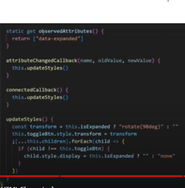

# Web Components

## Custom elements

Los custom elements se crean con clases

### HTMLElement

Clase que se extiende para crear el elemento.

```js
class HelloWorld extends HTMLElement {

  constructor() {
    super()
    this.innerHTML = `<h1>Hello World<h1>` /* Estructura elemento */
  }

  // Lógica adicional del elemento personalizado
  
}
```

Al ser una clase las diferentes propiedades del elemento html se declaran con `this`

### customElements.define()

Herramienta que instacia el elemento definiendo una etiqueta para utilizarlo.

Params --> html-tag, HTMLElement Class.

```js
customElements.define("hello-world", HelloWorld);
```

### Montar en html

```html
<body>
  <hello-world></hello-world>
</body>
```
### InnerText

Permite que el contenido del elemento sea el agregado en el HTML.

```js
constructor() {
  super();
  this.innerHTML = `<h1>${this.innerText}<h1>`
}
```

```html
 <hello-world>Hello world desde HTML!!</hello-world>
```

## Shadow DOM

Es una tecnología de la web que encapsulacomponente, permitiendo la creación de elementos HTML y CSS aislados y reutilizables, evitando interferencias con el resto de la página.

### Ver elementos del Shadow DOM

`devtools/elements/settings/elements/Show user agent shadow DOM` --> Esto hace que se vea el elemento como `#shadow-root (user-agent)`

Ejemplo --> Los option son por defecto elementos del shadow dom

### Utilizar shadow DOM dentro del componente

Instanciar el método `attachShadow` --> mode --> open, close --> Generalmente false. Para acceder al shadowRoot. `--> shadow`

Insertar el elemento en el `shadow`

Para acceder a los elementos se debe hacer por medio del shadow

```js
const template = document.createElement('template')
template.innerHTML = `
  <style>
    h3 {
      color: green;
    }
    </style>
    <h3 data-title></h3>
`

class Block extends HTMLElement {
  constructor() {
    super()

    const shadow = this.attachShadow({ mode: 'open' })
    shadow.append(template.content.cloneNode(true))
    this.h1 = shadow.querySelector('[data-title]')
    this.h1.textContent = this.textContent
  }
}

customElements.define('block-elm', Block)
```

## Slots

`<slot>` define un espacio que permite la inserción de contenido

```js
  <h3>
    <slot></slot>
  </h3>
```
```html
<block-elm>Soy un slot</block-elm>

### Slot name

Identifica al slot en el que se insertará el contenido.

```js
<h3>
    Soy un título   
    <span>
      <slot name="adicional"></slot>
    </span>    
  </h3>
```
```html
<block-elm></block-elm>
<block-elm>
  <span slot="adicional">+ Contenido adicional</span>
</block-elm>
```

## Ciclos de vida

Los métodos de manejo del ciclo de vida de los web components se declaran en el pie de la clase, es decir, después del contructor.

### observedAtribbutes()

Define los atributos a observar en los que se quiere detectar cambios.

Se establece en el cuerpo de la función un array con los atributos a observar.

### attributeChangeCallback()

Ejecuta acciones cuándo se produce un cambio en un atributo.

Parametros --> nombre del atributo, valor anterior, nuevo valor

Cuerpo de la función --> acción a ejecutar si el atributo cambia.

```js

 static get observedAttributes() {

    return ["data-count"]
  }

  attributeChangedCallback(name, oldValue, newValue) {
    if (name === "data-count") this.updateCount(newValue)
  }

  updateCount(value) {
    this.$span.textContent = this.dataset.count
  }

// ejemplo de cambiar el atributo para un count

let count = 0

const $block = document.querySelector('block-elm')

const $button = document.getElementById('button')

$button.addEventListener('click', () => {
  count++
  $block.dataset.count = count
})
```

### connectedCallback() / disConnectedCallback()

Establece acciones a realizar, si el componente se carga o se elimina.

```js
connectedCallback() {
    console.log('conectado')
  }

  disconnectedCallback() {
    console.log('desconectado')
  }
```

### Extendiendo elementos HTML nativos

Funcionalidad que permite utilizar los elementos nativos como web components.

Cada tipo de elemento HTML semántico cuenta con su propia clase creadora de web components --> Ejemplo: newComponent extends `HTMLUListElement`

En el `define` se utiliza un tercer argumento --> `{ extends: 'element' }`

```js
class ExpandableList extends HTMLUListElement {

  constructor() {
    super()

    this.$toggleButton = document.createElement('BUTTON')

    this.$toggleButton.textContent = '>'
    this.appendChild(this.$toggleButton)
    this.insertAdjacentHTML('afterbegin', styles)
  }
}

customElements.define('expandable-list', ExpandableList, { extends: "ul" })
```
En el HTML, se utiliza la etiqueta normal del componente con el atributo `is="web-componentname"`

```js
<ul is="expandable-list">
  <li>First</li>
  <li>Second</li>
  <li>Third</li>
  <li>Fourth</li>
</ul>
```



